# Rikard's Hangman
This is a Hangman game. A simple game that is played in the command line. The history of the game is somewhat unknown, but you can read more about it [here at wikipedia](https://en.wikipedia.org/wiki/Hangman_(game)).

The aim for the game is to guess a random word by one letter at the time. You have a limited number of attempts. If you manage to guess the word before you run out of attenpts you win, otherwise you get hanged.

This is a simpe game, but it is challenging. A nice way to relax and challenge yourself.

Welcome to [Rikard's Hangman](https://rikards-hangman.herokuapp.com/)!

## Contents

## User Experience
### User Stories
- As a user I want to understand how the game works quickly.
- As a user I want feedback while playing the game.
- As a user I want to be able to restart the game easily.
- As a user I want text that is easy to read.
- As a user I want color that helps me understand the feedback.

### Wireframes/Flowchart
As this game only is played in the terminal, no wireframes for the visual was done before the project started. I did a simple flowchart to guide me through the coding and to get a map for how I wanted it to work.

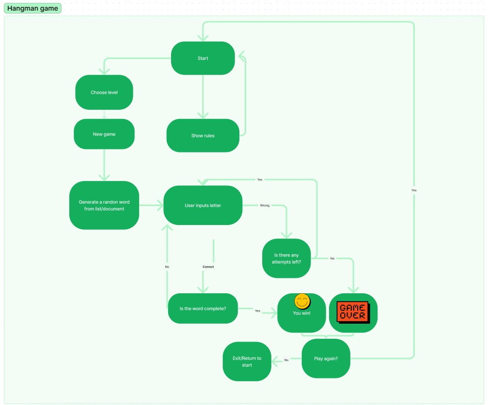

## Features
### Existing Features
#### Start
- When you start the game you will be able to enter your name. This is for personal feedback through the game.

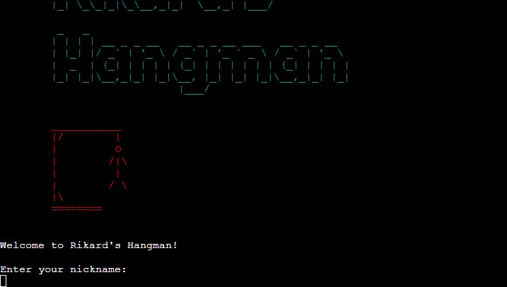

#### Menu
- In the next step you have two choices. Start the game or read the rules.

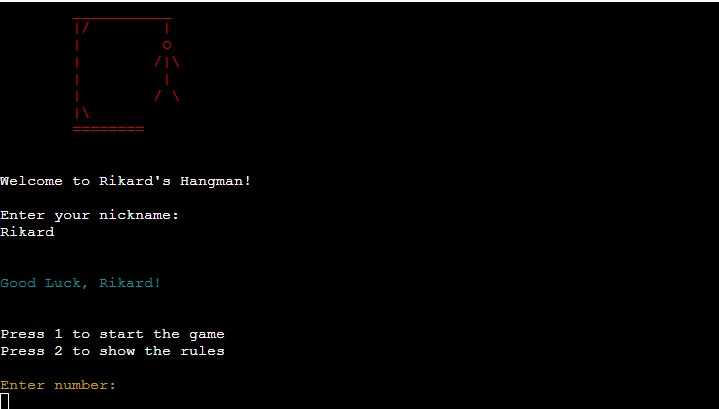

#### Rules
- A short explanation of the rules with the possibility to return to the main menu by hitting enter.

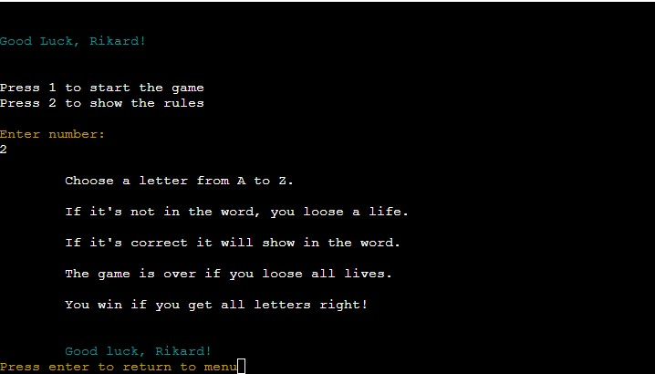

#### Choose Level
- When starting the game you have three different levels to choose from.

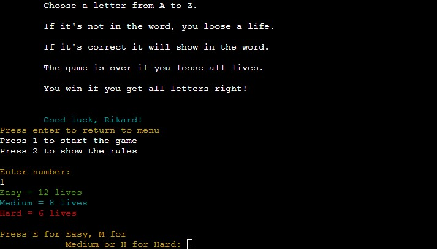

### Future Features

## Technologies Used
### Main Language
- [Python](https://www.python.org/)

### Other Frameworks, Libraries and Software Used
- Python Standard Library (OS and Random)
- [Figma](https://www.figma.com/) was used for the flowchart scetch.
- [Heroku](https://heroku.com/) was used to to deploy the live version.
- [GitHub](https://github.com/) was used for storing my repository.
- [Gitpod](https://www.gitpod.io/) was used to create all files with code.
- Files containing HTML, CSS and JavaScript was all provided by [Code Institute](https://codeinstitute.net/) for this project. 

## Testing
This project has been tested manually for the most part. Mostly by myself playing it over and over again to make sure the logic worked. Manual testing was also done for making sure I got necessary feedback while playing, and that the feedback was presented in a clear way.

### Validator testing
The code has been tested with [PEP8 online](http://pep8online.com/).
At first there were some warnings about trailing whitespaces and too long lines. But now it passes without any warnings or errors.

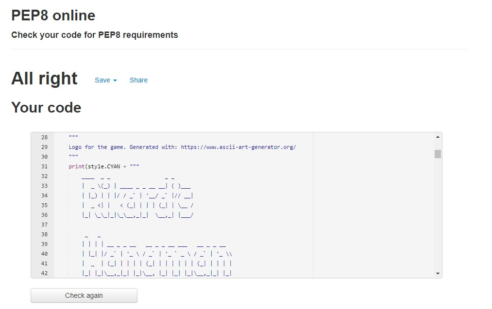

## Bugs

### Solved

### Left to Solve

## Deployment
### To deploy the project
This application is deployed using [Heroku](https://heroku.com/).

The steps for deploying through [Heroku](https://heroku.com/) is as follows:

1. Visit [Heroku](https://heroku.com/) and make sure you are logged in.
2. Click on New and then choose New App.

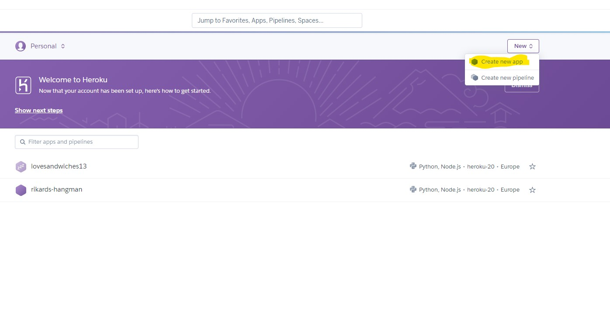

3. Choose a name for your app and then choose your region.
4. Then press 'Create app'.

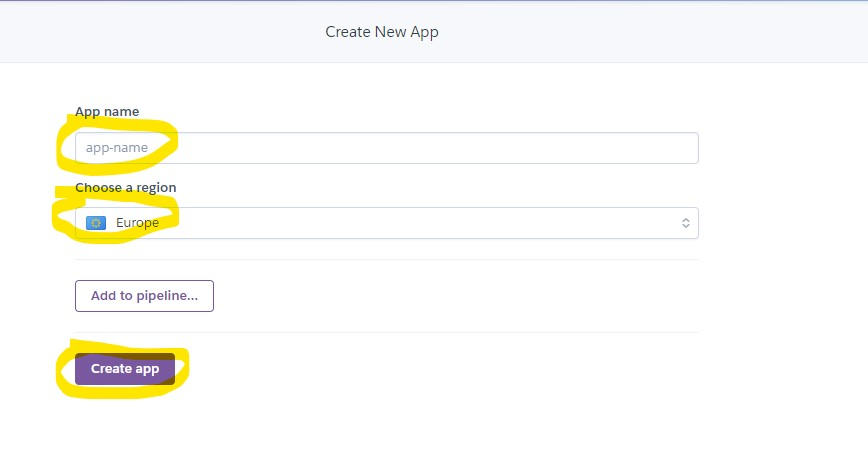

5. Make sure youo are on the 'Deploy' tab.
6. Choose connect to GitHub account.
7. Search for your repository that you want to deploy.
8. Press 'Connect'

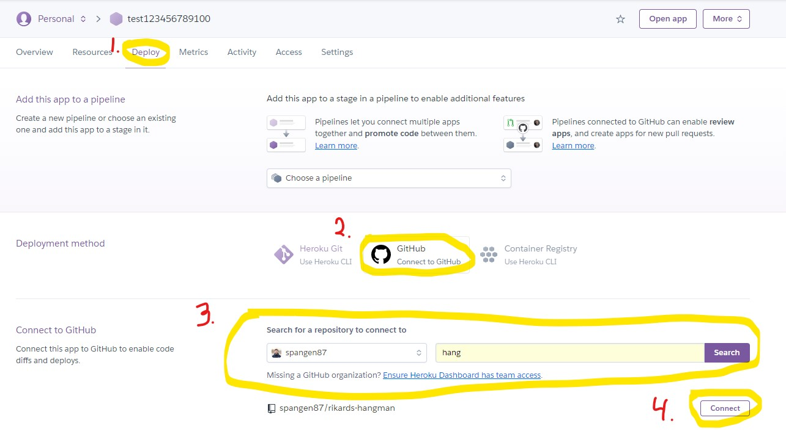

9. Choose if you want automatic deploys from your repository on GitHub.
10. Choose which branch you want to deploy.
11. Press 'Deploy Branch'.

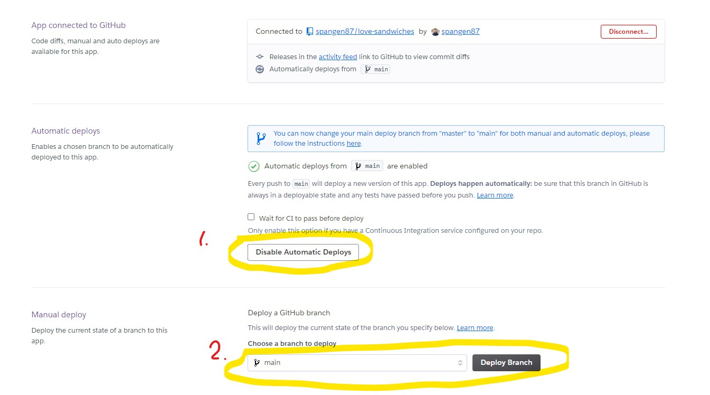

12. When the installation is done. Go to the settings tab.
13. Press on 'Reveal Config Vars'.

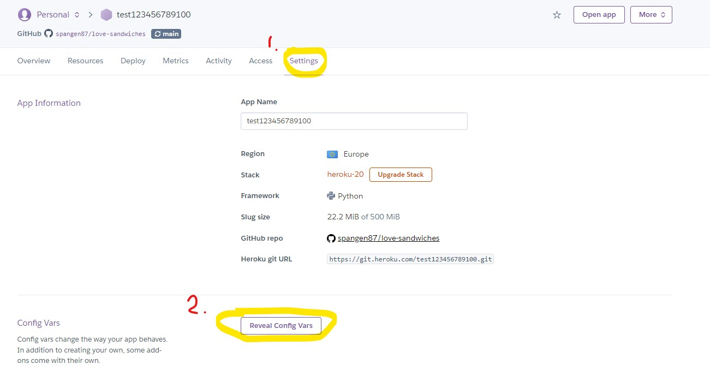

14. Add config vars that are necessary. In this project it was the one showed below.

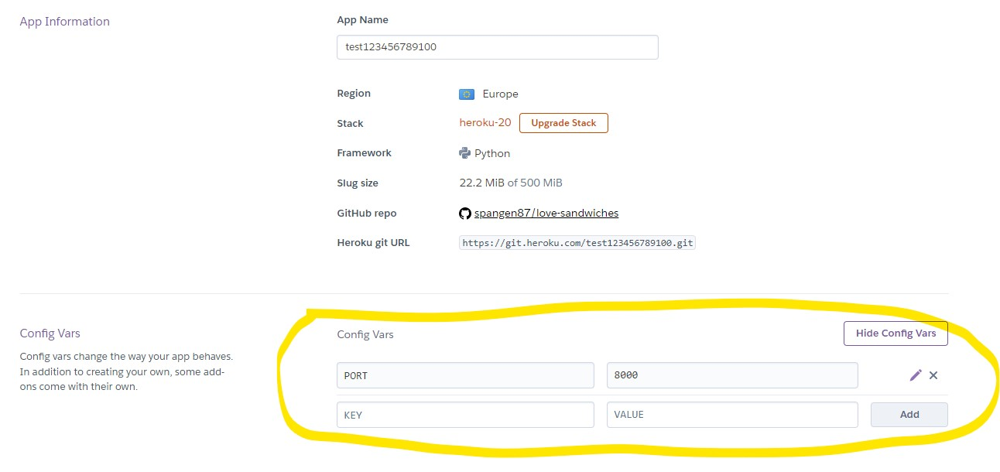

15. Add the nuildpacks needed. In this project it was Python and Nodejs.

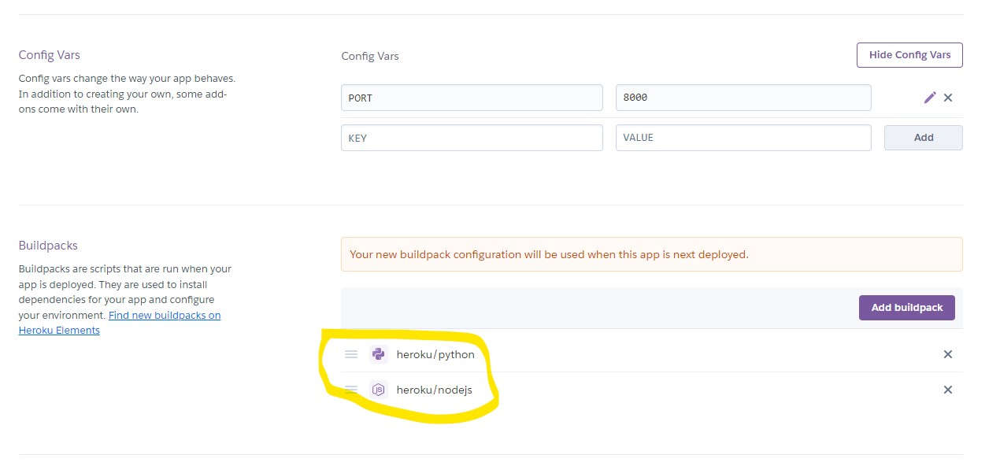

16. Now you are done and can open the app!

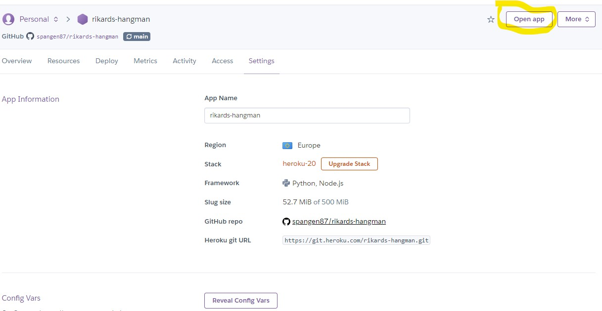

[Back to top](#contents)
### Forking the repository on GitHub
A copy of the repository can be made. This copy can be viewed and changed on another account without affecting the original repository.

The steps for doing this:
1. Make sure you are logged in on GitHub and then find the repository.
2. On the top right there is a button called Fork.
3. Press the Fork button to make a copy to your account.

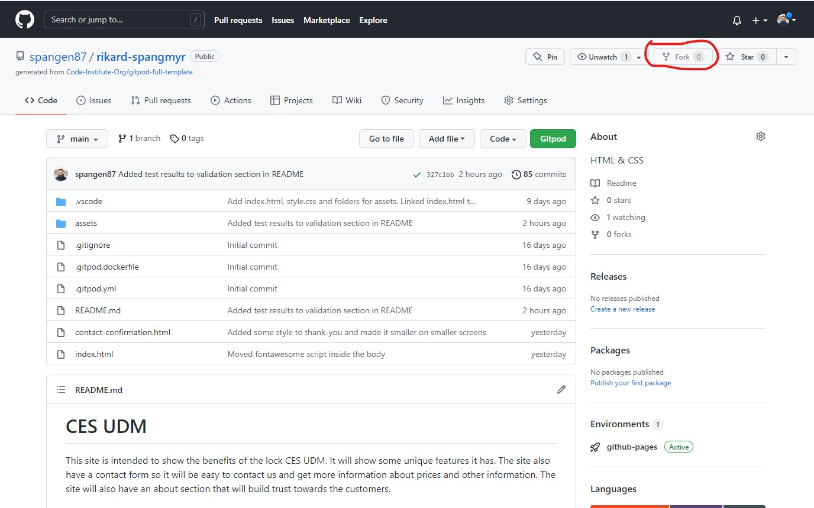

[Back to top](#contents)
### How to clone the project
This is how you make a clone of the repository:

1. Click on the code tab under the repository name.
2. Then click on "Code" button to the right above the files listed.
3. Click on the clipboard icon to copy the URL.

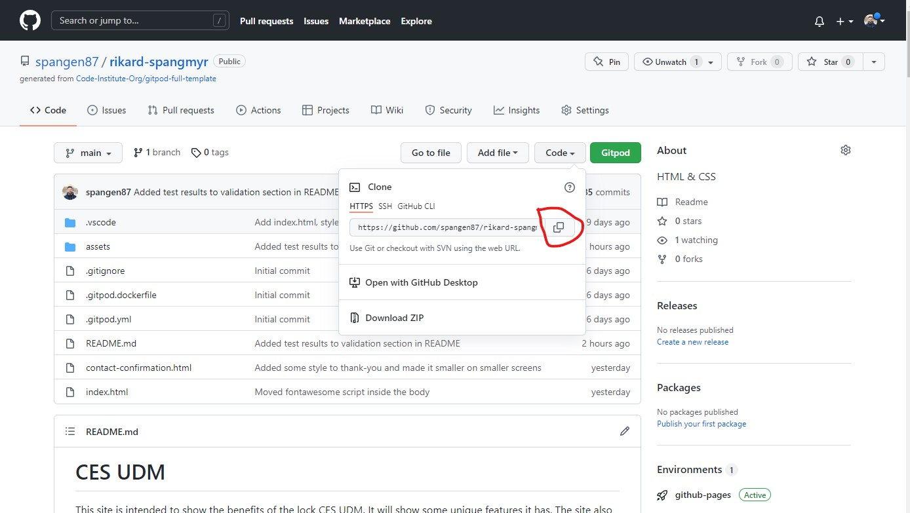

4. Open Git Bash in the IDE of your choice.
5. Change the working directory to where you want your cloned directory.
6. Type `git clone` and then paste the URL that you copied.
7. Press enter and clone has been finished.

## Credits

## Acknowledgements
