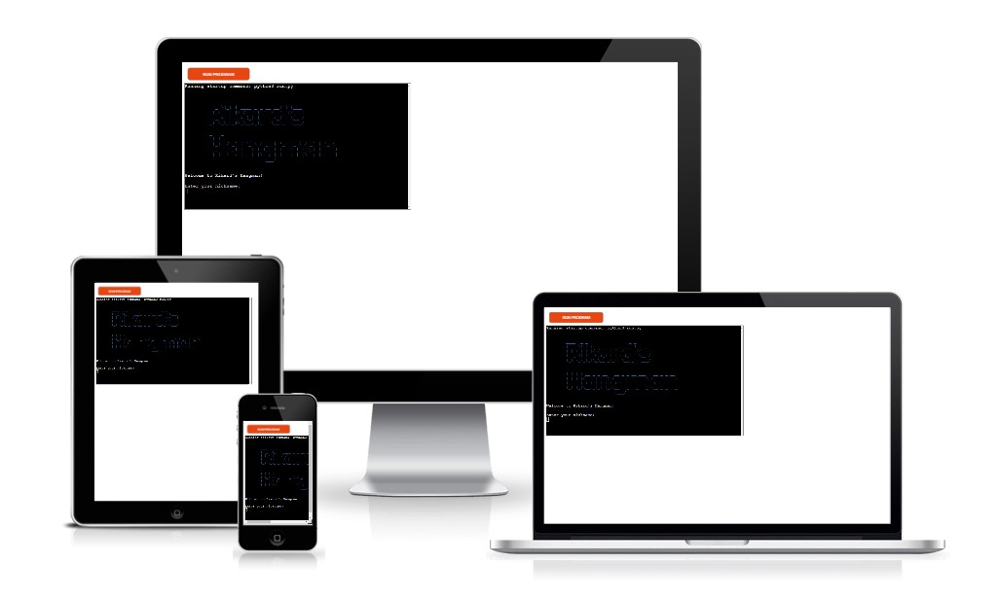
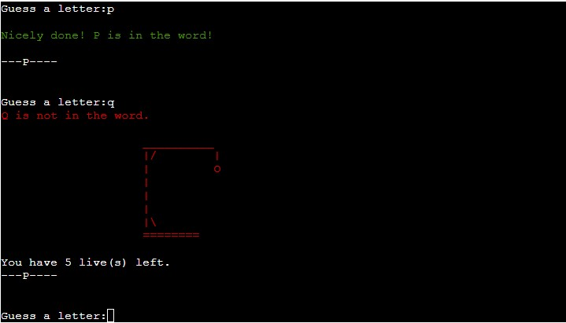
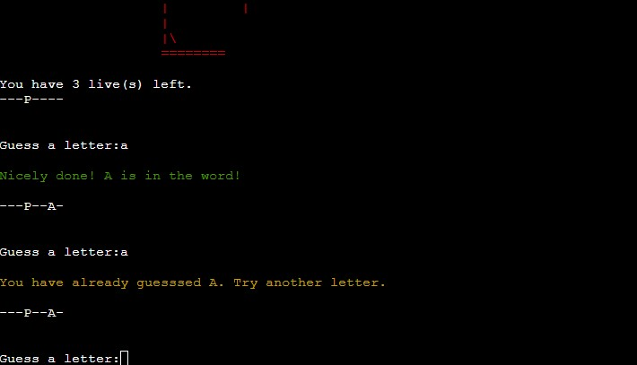
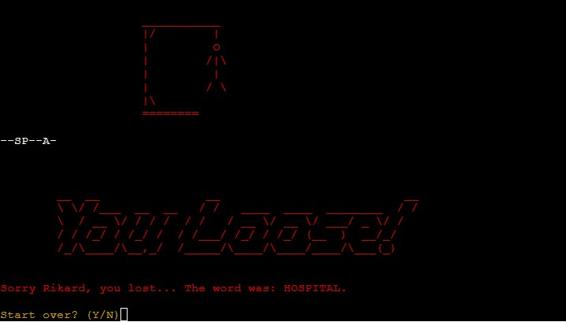
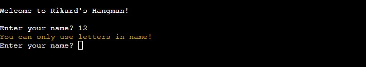
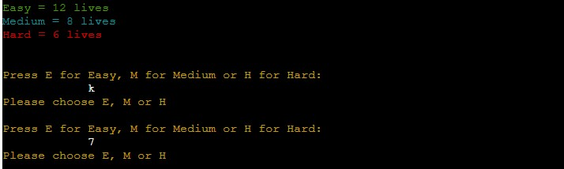
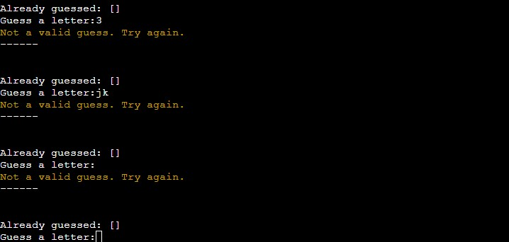

# Rikard's Hangman
This is a Hangman game. A simple game that is played in the command line. The history of the game is somewhat unknown, but you can read more about it [here at wikipedia](https://en.wikipedia.org/wiki/Hangman_(game)).

The aim for the game is to guess a random word by one letter at the time. You have a limited number of attempts. If you manage to guess the word before you run out of attenpts you win, otherwise you get hanged and loose the game.

This is a simpe game, but it is challenging. A nice way to relax and challenge yourself.

Welcome to [Rikard's Hangman](https://rikards-hangman.herokuapp.com/)!

## Contents

## User Experience
### User Stories
- As a user I want to understand how the game works quickly.
- As a user I want feedback while playing the game.
- As a user I want to be able to restart the game easily.
- As a user I want text that is easy to read.
- As a user I want color that helps me understand the feedback.

### How to play
- The program chooses one word randomly from the list with 500 different words.
- The player then chooses which level they want to play (how many attemtps).
- The word is presented as dashes, one for each letter in the word. There is a print that tells the player how many letters there is in the word.
- It is only allowed to guess one letter at a time. No attempts is used if it's a correct guess.
- When the players guess is wrong, it will notify that and show hangman graphic that is different depending on how many lives there is left.
- The player wins when the word is guessed and all lives are not lost. A greeting will show.
- The player loses if the lives runs out. A message will show to tell the game is over.
- When the game is finished the player can choose to restart, or otherwise return to the starting screen.

### Wireframes/Flowchart
As this game only is played in the terminal, no wireframes for the visual was done before the project started. I did a simple flowchart to guide me through the coding and to get a map for how I wanted it to work.

### Design
The design is very limited in this because it's played through the terminal. But I have put some color and ASCII-art in it to make it look more appealing. This also helps with the feedback as the text is in different color for when you guess right or wrong for example.

## Features
### Existing Features
#### Start
- When you start the game you will be able to enter your name. This is for personal feedback through the game.

#### Menu
- In the next step you have two choices. Start the game or read the rules.

#### Rules
- A short explanation of the rules with the possibility to return to the main menu by hitting enter.

#### Choose Level
- When starting the game you have three different levels to choose from.

#### Playing the game
- When playing the game you recieve feedback in green when the guess is correct. Along with the letter in the correct position.
- If you guess wrong, it will notify you in red text along with the hangman that grows for every wrong guess.

#### Guessing same letter
- If you guess same letter more than once you will be notified in yellow text. No lives is withdrawn and you can try again.

#### End of game
- When game is finished you will be greeted with different graphics and colors depending on if you win or loose.
- You can choose if you want to play again or return to main screen.

### Future Features
- Choose the length of the word when playing.
- Add more graphics and maybe a background image instead of the white background.

## Technologies Used
### Main Language
- [Python](https://www.python.org/)

### Other Frameworks, Libraries and Software Used
- Python Standard Library (OS and Random)
- [Figma](https://www.figma.com/) was used for the flowchart scetch.
- [Heroku](https://heroku.com/) was used to to deploy the live version.
- [GitHub](https://github.com/) was used for storing my repository.
- [Gitpod](https://www.gitpod.io/) was used to create all files with code.
- Files containing HTML, CSS and JavaScript was all provided by [Code Institute](https://codeinstitute.net/) for this project. 

## Testing
### Manual testing
This project has been tested manually for the most part. Mostly by myself playing it over and over again to make sure the logic worked. Manual testing was also done for making sure I got necessary feedback while playing, and that the feedback was presented in a clear way.

### Input validation
- When entering your name in the start it validates that it is only letters entered.

- When choosing 1 or 2 in the meny it validates that, if you put something else in it will tell you that you need to choose 1 or 2.
- When choosing level it makes sure you choose a valid input.

- When guessing letters it validates that the input is one letter and nothing else.

- If you guess same letter twice you will be notified and will be able to try again.

### Validator testing
The code has been tested with [PEP8 online](http://pep8online.com/).
At first there were some warnings about trailing whitespaces and too long lines. But now it passes without any warnings or errors.

### Lighthouse
A test was done in lighthouse for accessibility, performance and best methods used.
In this case I can't take the results to seriously because the HTML, CSS and JavaScript was pre made in the template provided by Code Institute.

## Bugs
### Solved
- Prints that had to be on more rows than one got distorted in the terminal. Solved it by removing indentation on prints that were more than one row.
- If you were in the menu and made an incorrect input the game starting. I solved it by placing it in a while loop that checked that a valid input was given beforde moving on.

### Left to Solve
- When choosing difficulty the marker for input shows up in the middle of the screen instead of aligning to the left.

## Deployment
### To deploy the project
This application is deployed using [Heroku](https://heroku.com/).

The steps for deploying through [Heroku](https://heroku.com/) is as follows:

1. Visit [Heroku](https://heroku.com/) and make sure you are logged in.
2. Click on New and then choose New App.

3. Choose a name for your app and then choose your region.
4. Then press 'Create app'.

5. Make sure youo are on the 'Deploy' tab.
6. Choose connect to GitHub account.
7. Search for your repository that you want to deploy.
8. Press 'Connect'

9. Choose if you want automatic deploys from your repository on GitHub.
10. Choose which branch you want to deploy.
11. Press 'Deploy Branch'.

12. When the installation is done. Go to the settings tab.
13. Press on 'Reveal Config Vars'.

14. Add config vars that are necessary. In this project it was the one showed below.

15. Add the nuildpacks needed. In this project it was Python and Nodejs.

16. Now you are done and can open the app!

[Back to top](#contents)
### Forking the repository on GitHub
A copy of the repository can be made. This copy can be viewed and changed on another account without affecting the original repository.

The steps for doing this:
1. Make sure you are logged in on GitHub and then find the repository.
2. On the top right there is a button called Fork.
3. Press the Fork button to make a copy to your account.

[Back to top](#contents)
### How to clone the project
This is how you make a clone of the repository:

1. Click on the code tab under the repository name.
2. Then click on "Code" button to the right above the files listed.
3. Click on the clipboard icon to copy the URL.

4. Open Git Bash in the IDE of your choice.
5. Change the working directory to where you want your cloned directory.
6. Type `git clone` and then paste the URL that you copied.
7. Press enter and clone has been finished.

## Credits
- [Kite YouTube tutorial](https://youtu.be/m4nEnsavl6w) was helpful when setting up the basic structure of the game.
- [Randomlists.com](https://www.randomlists.com/random-words) for generating 500 words that i could copy to a file.
- [Ascii Art Generator](https://www.ascii-art-generator.org/) for generating graphics from text.
- [gibbo101](https://github.com/gibbo101/hangman/tree/64cbf149ccc49eee729285e066a1d46bac1ae404) for the hangman graphics printed when you loose a life. 

## Acknowledgements
This game was made as the Porfolio Project 3 for the Full Stack Software Developer education at [Code Institute](https://codeinstitute.net/). A big thanks to my mentor [Precious Ijege](https://www.linkedin.com/in/precious-ijege-908a00168/) for supporting me through the project.
I also would like to thank the community at Code Institutes Slack channel, my colleagues and friends who took the time to test the game.

I hope this game will bring some joy to the people that will take the time to test it.

Rikard Spångmyr, 2022